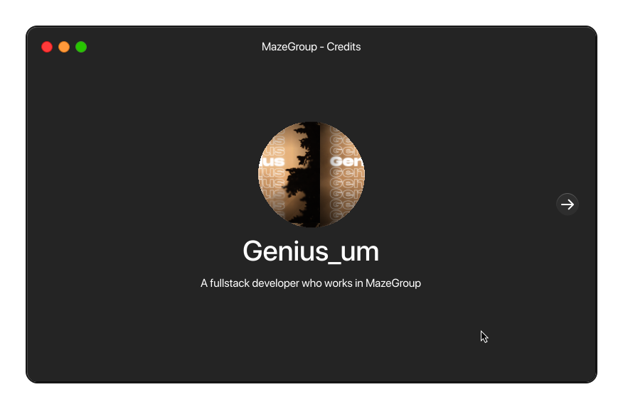

# Genius_um
## I'm a developer fullstack seeking to make more and more innovative projects. I'm also UI Designer, video editor, streamer and youtuber.
> All projects I do are under the name of MazeGroup, my organization.

# My skills
## Languages :

## Tools :

## MazeGroup :
> MazeGroup is my organization I fonded with [Rayanis55](https://github.com/Rayanis55) to upload my projects under it name.

[MazeGroup website](https://mazegroup.org/)

